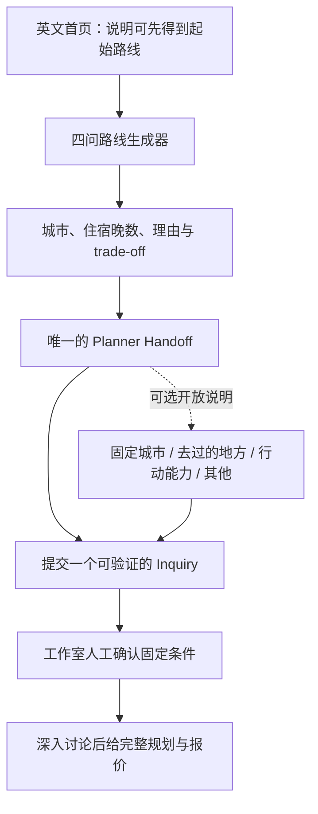

# Homeground 转化闭环与城市约束验证计划

版本：2026-07-18.1
状态：决策与验证计划，不包含本轮代码实施
第一目标市场：英文长线访华游客
核心商业目标：先证明游客愿意带着真实需求联系 Homeground，再扩充自动规划功能

实施依据：`docs/homeground-v1-inquiry-handoff-spec.md`。如本计划中的早期设想与该 Spec 冲突，以 Spec 为准；V1 只接受完成四问后的 `generated_route` 咨询，`direct_fixed_plan` 仍属于后续 Phase 3B。

## 1. 最终决策

### 现在做

1. 保留目前四问路线生成器，不增加第五道“选择城市”问题。
2. 先修通“生成路线 → 提交真实咨询 → 工作室继续跟进”的闭环。
3. 在咨询表单中用一条可选开放问题收集固定城市、已订航班、去过的地方和行动能力需求。
4. 先编码至少 50 个已提交英文 Inquiry（其中至少 30 个合格咨询），判断城市约束是否值得产品化。
5. 数据证明需求后，再单独测试结构化城市约束；第一版也不自动重算路线。

### 现在不做

- 不做开放式城市多选墙。
- 不把任意城市硬塞进现有路线。
- 不同时上线首屏大改、结构化城市选择、AI 和多套平行联系漏斗。
- 不接通用 AI 悬浮聊天或 Codex SDK。
- 不做价格计算器、合同、付款、账号系统或自动 PDF 计划书。
- 不为了“内容丰富”新增更多主页模块。

一句话结论：

> 城市选择是一个值得验证的需求，但目前应该把它当成“人工规划需要尊重的约束”，而不是让游客先完成一场中国地理考试。

## 2. 已经验证了什么

### 2.1 当前核心功能成立

本轮通过真实浏览器、移动端视口、键盘操作、页面源码和构建结果进行了核验：

- 英文、中文、韩文页面均可正常访问。
- 四个问题可以完整生成路线。
- 回退、修改答案和同标签页恢复正常。
- 不同旅行成员与节奏会触发少换酒店的路线版本。
- 结果包含城市、住宿晚数、城市间移动次数、选择理由、舍弃项和未确认条件。
- 375–390px 移动端没有横向溢出。
- 构建、类型检查和静态导出通过。
- 当前输入空间约为 300 种答案组合，实际落到约 28 种路线形态。
- 当前自动路线库存只覆盖 9 个城市。

因此，路线生成器不是装饰模块；它已经能够提供有意义的起点。

### 2.2 当前没有验证什么

目前只能验证游客点击了邮件按钮，不能验证：

- 邮件是否真的发送；
- WhatsApp 是否真的开始对话；
- 留下联系方式的人是否为有效游客；
- 有效游客是否愿意进入报价；
- 城市约束是否提高有效咨询；
- 最终是否愿意付费。

所以本计划把“真实提交的咨询”作为下一阶段基础，而不是继续用按钮点击推断商业需求。

## 3. 当前网站审查结论

### 3.1 最重要的断点：结果之后没有闭环

当前结果页只有 `mailto:`。英文邮件链接约 1800 字符，中文和韩文更长。它依赖访客本地邮件客户端，网站只能记录 `planner_email_clicked`，不能确认发送成功。

同时，用户已有结果后，页头、Studio 和页尾的主 CTA 仍把用户带回已经看过的路线。这形成了一个回环：

```text
完成四问
  → 看见路线
  → 点击主 CTA
  → 回到同一条路线
  → 没有可靠的下一步
```

应改为：

```text
完成四问
  → 看见路线与关键 trade-off
  → 提交同一份路线给工作室
  → 看见成功状态和回复预期
  → 工作室按唯一 inquiry_id 接手
```

### 3.2 主页模块本身不需要继续增加

当前结构可以保留：

1. Hero + Route Finder：立即给价值。
2. Planning Proof：解释人工判断比城市清单多了什么。
3. Studio：解释规划、复核和地接交付的角色。
4. FAQ：解决剩余顾虑。
5. Final CTA：给尚未行动的人最后入口。

问题不在模块数量本身，而在模块之间的状态和职责重复。后续应：

- 全站只保留一个真正的 planner handoff。
- 结果状态的所有主 CTA 都指向这个 handoff。
- “修改答案”和“重新开始”保留为次级操作。
- 把“联系后会发生什么”从 FAQ 移到 handoff 旁。
- Proof、Studio 和 FAQ 各自只回答一个问题，不重复解释交付流程。

### 3.3 上线验证前必须处理的信任与品牌问题

- 首屏能看懂“免费路线工具”，但还不够清楚 Homeground 能继续完成整套规划并协调合适的地接。
- 目前只有个人 Gmail，缺少品牌邮箱和明确回复时效。
- 没有真实评价时不能伪造 testimonial；可以先使用一份真实且脱敏的规划片段。
- 团队框架可以保留，主页不需要团队大照片；后续补名字、职责和语言即可。
- Visa Guide 仍出现旧的 “About Xuan”“Talk to Xuan” 和个人化承诺，与工作室品牌冲突。迁移前应暂时取消生产发布、从 sitemap 移除并设置 `noindex`；只隐藏主页导航不够。
- Visa Guide 中“绝不跟团巴士”“无隐藏费用”“完全处理”等绝对承诺需要重新审查。
- 新品牌 Logo 尚未统一到 favicon/app icon，应在品牌清理时一并处理。

### 3.4 技术与维护问题

- 路线只保存在 `sessionStorage`，不能跨标签页、跨设备或稳定分享给同行人。
- 当前路线规则是静态模板，尚未检查真实机场、铁路班次、城市邻接或季节性交通。
- 页面可以说这是“starting route”，但不能暗示已经完成交通可行性验证。
- GA 已加载，但没有隐私入口或分析同意机制；英文市场投放前需要处理。[英国 ICO 的现行指导](https://ico.org.uk/for-organisations/direct-marketing-and-privacy-and-electronic-communications/guide-to-pecr/cookies-and-similar-technologies/)要求说明非必要 cookies/类似技术的用途，并在设置前取得有效同意。
- 多个实验 Lab 页面和约 74MB 实验资产仍会进入生产导出。
- 旧主页代码仍在仓库中，短期不冲突，但增加误用和维护风险。

## 4. 为什么现在不把城市选择放进四问

### 4.1 三类用户需要的不是同一种城市选择

| 用户 | 真正需要 | 直接城市多选的问题 |
|---|---|---|
| 第一次来中国、不熟悉城市 | 让 Homeground 帮他把旅行感觉翻译成路线 | 城市墙把“不会选”重新变成“先做功课” |
| 已订机票或有必去地点 | 告诉规划师哪些条件不能改变 | 普通“偏好城市”无法表达硬约束 |
| 来过中国 | 表达哪些地方去过、哪些想重访或避开 | “去过”不等于“不想再去” |

### 4.2 当前底层接不住开放选择

现有系统只有约 28 种路线形态和 9 个城市。开放任意城市多选会产生大量无法诚实处理的组合，例如：

- 7 晚同时选择北京、成都、张家界和上海；
- 带父母、Gentle 节奏，却固定重庆、张家界和景德镇；
- Food 风格、7 晚、北京必去，但当前食物路线只覆盖成都和重庆；
- 回头客希望避开北京、上海和西安，而现有慢旅行路线依赖上海。

如果只改城市和住宿晚数，静态的 `routeReason`、`tradeoff` 和交通描述就会与结果冲突。这会比不给选择更伤信任。

### 4.3 行业做法不能直接照搬

[China Highlights 的询价表单](https://www.chinahighlights.com/tour/create-my-tour.php)把目的地标成可选，并向第一次访华用户推荐城市；这适合已经准备询价的人，不等于应该把城市选择放进“帮我决定去哪”的发现流程。

[GOV.UK 的表单结构指导](https://www.gov.uk/service-manual/design/form-structure)建议只有在明确知道为什么需要某个答案、如何使用它、哪些用户需要回答时才增加问题，并通过分支只向相关用户提问。这支持“条件式约束”，不支持给所有人增加城市题。

[Audley 的咨询流程](https://www.audleytravel.com/us/contact-us)和 [kimkim 的中国专家页面](https://www.kimkim.com/d/china/travel-agents)也说明，高客单定制旅行最终依靠可联系的专家、明确跟进和信任证明，而不只是更多前台选项。

## 5. 推荐的最终用户路径



关键规则：

- 四问仍然负责“把不会选变成会选”。
- 固定城市等信息进入咨询上下文，不作为第五问阻挡结果。
- 结果后始终能看见“继续咨询”的入口；它只打开或聚焦表单。唯一最终 Submit 位于所有必填和可选字段之后。
- Phase 1 的开放说明只确认“已附在咨询中，尚未改变路线”；进入 Phase 3 的结构化地点字段后，才精确说明“已在路线中”或“尚未加入，将由规划师复核”。
- 在没有日期、机场和交通验证前，不自动把城市插入路线。
- `route_id + rule_version` 只标识路线规则；`journey_id` 标识一次匿名结果实例；`inquiry_id` 标识一次真实咨询，三者不得混用。

## 6. 分阶段实施与验证

### Phase 0：修确定性断路

目标：让每一条已有路线都有明确下一步。

Phase 0 的 CTA 和 Phase 1 的可提交 Inquiry 必须作为同一个原子版本上线。不得先把 CTA 指向一个尚不存在或尚不能成功提交的 `#planner-handoff`。

其中只有“结果态 CTA 不再指回结果顶部”属于正确性修复。handoff 上移和内容重排建立新的产品基线，不用上线前后的转化变化宣称因果效果。

#### 改动

- 结果状态下，页头、Studio 和页尾的主 CTA 改为：
  - `Ask a planner to review this route`
  - 统一指向 `#planner-handoff`
- 保留 `Edit answers` 和 `Start again` 为次级操作。
- 把 handoff 提前到路线摘要和关键 trade-off 之后。
- 在 handoff 之前保留一条简短声明：这是 starting route，日期、机场、季节和具体交通尚未核验，也不代表预订已经发生。
- 把页面中暗示 transport logic 已经核验或路线已证明可行的表述，改成“基于当前答案的 draft，等待人工交通复核”。
- 路线细节、假设和完整答案回顾放在 handoff 之后。
- 结果卡上的前置 CTA 只负责打开或聚焦 handoff，使用 `Continue to planner request`；唯一最终 Submit 位于所有可编辑字段之后。
- Visa Guide 二选一：完成团队化迁移和承诺审查后继续发布；或暂时取消生产发布、从 sitemap 移除并设置 `noindex`。只隐藏主页导航不算完成。

#### 验收

- 已有结果时，没有任何主 CTA 再指回路线顶部。
- 桌面和移动端在看完关键路线信息后一屏内能看见 handoff。
- 所有结果 CTA 都进入同一个 handoff，不复制第二套表单。
- 最终 Submit 位于 Email/WhatsApp 联系字段和可选说明之后。
- handoff 保存、工作室通知和备用路径均通过真实端到端测试。

### Phase 1：建立一个可验证的 Inquiry

目标：从“按钮点击”升级到“确认收到的真实咨询”。

#### 部署架构决策

当前站点使用 Next.js `output: "export"`，纯静态导出本身不能保存 Inquiry 或安全持有密钥。

推荐第一版保留静态前端，连接一个独立的 serverless Inquiry API：

```text
静态 Homeground 页面
  → HTTPS serverless Inquiry API
  → 受控持久化
  → 工作室通知与查询入口
```

实现前必须明确：

- API 与数据存储由哪个账号和地区托管；
- 密钥只存在服务端环境变量，不进入静态包；
- 谁是数据控制者、谁能访问、保存多久、如何删除；
- 通知发到哪个品牌邮箱，以及失败由谁处理。

如果不采用外部/serverless API，就必须先把网站迁移到支持服务端运行的部署架构；两种方案不能都留给实施阶段临时决定。

#### 单一表单

必填：

- `How should we reply?`：Email / WhatsApp 条件式单选。
- 选择 Email 后，只显示并必填 email 字段，使用 `type="email"` 和 `autocomplete="email"`。
- 选择 WhatsApp 后，只显示并必填国际号码字段，使用 `type="tel"`、`autocomplete="tel"`，并保存 E.164 规范格式。
- 无论选择哪种回复方式，都保存为同一种 Inquiry，不形成两套业务对象。
- 校验失败时保留输入、把焦点送到错误摘要；服务端成功后才显示提交成功状态。

选填：

> What should this route respect—fixed places, flights already booked, places you have visited, mobility needs, or anything else?

自动附带，不让用户重填：

- `entry_path: generated_route`；
- 服务端生成的唯一 `inquiry_id`；
- 一次结果实例对应的匿名 `journey_id`；
- 四个答案、完整路线快照、`route_id` 和 `rule_version` 均为必需上下文；
- 页面语言；
- 来源和 UTM；
- 实验版本。

服务端保存成功后才记录 `handoff_submitted`。失败时保留用户输入，并显示可见邮箱作为备用。

Phase 1 对开放文本只显示：

> Your note has been attached for planner review. It has not changed this starting route.

这一阶段不解析城市、地区、航班或否定表达，也不显示 `already included / not included yet`。

#### 后端与交付验收

- 服务端只接受白名单答案 ID，并用 `rule_version` 重新生成或核对路线，不能直接信任浏览器提交的路线快照。
- 每次提交生成唯一 `inquiry_id`；幂等键避免刷新或重试产生重复咨询。
- 联系方式和开放文本持久化成功后，再触发工作室通知。
- 工作室通知失败需要自动重试，并有人工可查询的 Inquiry 列表或最小管理入口。
- 分别验收“服务器已保存”和“工作室实际收到并可处理”，前者不能代替后者。
- 品牌邮箱必须通过真实收发测试，并保留一个可见备用联系方式。
- 所有用户可控字段都做服务端白名单/格式校验、长度限制、输出转义、限流和垃圾标记，包括 Email、WhatsApp、开放文本、UTM、来源和语言参数，防止最小管理入口出现存储型注入。
- WhatsApp 账号只有在真实设备、`+86` 号码和至少一个目标市场号码端到端测试成功后才公开。

#### 上线门槛

Inquiry 不得脱离信任、隐私和运营能力单独向真实流量开放。第一批真实流量进入前必须同时具备：

- 品牌邮箱和可兑现的具体回复时效；
- 最小真实工作室身份与一份脱敏规划证明；
- 表单旁清楚说明资料用途、回复方式和隐私入口；
- 联系方式、开放文本和可能涉及行动能力信息的访问、保留与删除规则；
- GA 等非必要分析技术的有效同意机制；
- 行动能力只询问旅行中的功能需求，不询问医学诊断；Inquiry 不得在未单独同意时用于营销；
- 基础 honeypot、服务端限流和垃圾标记；只有真实出现自动垃圾提交后再考虑 CAPTCHA。

#### WhatsApp 决策

- 用户提供的工作室号码可规范为 `+86 131 7421 5999`。
- 如果后续增加直接 WhatsApp 链接，应使用 `https://wa.me/8613174215999` 并带短的 route reference。
- `whatsapp_clicked` 仍然只是点击，不算有效咨询。
- 第一轮验证应以已保存的 Inquiry 为主，避免把 WhatsApp、Email 和 mailto 误当成三个可比较的“提交成功”。

#### 数据状态

每个 Inquiry 至少有：

```text
submitted
  → replied
  → qualified / unqualified / unreachable / no_response / spam
  → proposal_started
  → paid / lost
```

每次状态变化记录操作者和时间戳，避免把回复速度或事后主观判断误当成实验效果。

#### Phase 1A：结果分享

原子转化版本稳定后，再建立分享后的新基线：

- 把枚举答案 ID、语言和规则版本编码进可分享 URL。
- URL 不包含联系方式、开放文本或其他个人信息。
- 新标签页打开链接时，用相应规则版本重新生成同一结果。
- 非法、过期或未知参数安全降级到第一题并说明原因。
- 分享产生新的 `journey_id`，但保留相同 `route_id + rule_version`。

验收：

- 新标签页、另一台设备和三种语言入口都能恢复预期结果。
- 篡改参数不会报错、注入内容或生成理由与城市不一致的路线。
- 分享链接不会把原游客的 Inquiry 或实验身份泄露给接收者。

#### 合格咨询定义

满足以下条件才算 `qualified_lead`：

- 联系方式真实且可继续沟通；
- 有真实的中国旅行意图；
- 工作室回复后，游客愿意进入具体需求讨论；
- 不是垃圾信息、供应商推销或纯政策问答。

是否进入报价和是否付费继续单独记录。

### Phase 2：先用开放文本学习城市需求

目标：不建设城市选择器，先知道用户实际表达的是什么。

对每一个已提交的英文 Inquiry 进行人工标记，再单独报告 qualified 子集：

- `fixed_arrival_or_departure`
- `must_include_place`
- `already_visited`
- `prefer_no_repeat`
- `repeat_welcome`
- `mobility_constraint`
- `route_not_relevant`
- `unsupported_place`
- `general_question`

同时记录：

- 该约束是否导致路线家族改变；
- 是否只需调整住宿晚数；
- 是否因当前城市库存不足无法处理；
- 是否提高了咨询质量；
- 是否进入报价和付费。

低流量阶段不做形式化 A/B。探索阶段先累计至少 50 个已提交 Inquiry，其中至少 30 个为合格英文咨询，并全部人工编码。30–50 个合格咨询只能发现模式，不能证明精确的转化提升。

### Phase 3：单独测试结构化城市约束

只有 Phase 2 反复出现固定地点或去过地点后，才进入这一阶段。

#### 测试位置

仍在结果后的同一个 handoff 内，默认折叠、完全可跳过：

> Add useful context before sending — optional

#### 推荐字段

1. `Anything already fixed?`
   - Nothing fixed yet
   - Add one must-include place
2. `Have you travelled in China before?`
   - No
   - Yes
3. 若 Yes：
   - Mostly new places
   - A mix is fine
   - Repeats are welcome
4. 可选：
   - Up to 3 places you would rather not repeat

选择固定地点后即时反馈：

- `Beijing is already included in this draft.`
- `Guilin is not included yet. A planner will review how it could fit before changing the route.`

注意：

- 这不是第五步。
- 不出现新的进度数字。
- 不要求用户必须展开。
- 不阻挡提交。
- 所有内容与路线快照一起进入同一个 Inquiry。
- 修改四问后，约束保留并重新检查。
- `Start again` 时约束一并清除。
- 必去地点使用规范地点 ID、英文/中文/韩文本地化标签和同义词映射；`Other` 只进入人工复核，不假装已被自动理解。

#### 实验设计

- A：四问 + 原始开放文本 handoff。
- B：四问 + 可选结构化约束 + 完全相同的 handoff。
- 两组的开放文本、联系方式字段、CTA、位置、成功状态和人工回复流程完全相同；B 只多一个可选的结构化 disclosure。
- 随机化单位固定为匿名 `experiment_subject_id`，不能使用 `journey_id` 代替。
- 在用户首次看见结果且已满足分析同意条件时生成 `experiment_subject_id`，分组后在同一浏览器中保持到实验结束并覆盖 14 天资格判定窗口。
- 刷新、修改路线和返回网站都不能跨组；新分享链接的接收者生成新的实验主体。
- 未同意分析的用户不进入正式 A/B，仍正常看结果和提交 Inquiry。
- 第一轮只在英文市场随机实验；中文和韩文保持原流程，不再拆分有限流量。
- 实验期间固定 `rule_version`。
- 首次访问和返回用户分开分析。
- 测试期间不同时修改首屏核心定位。
- 主分析使用 intent-to-treat：所有进入 B 组的人与所有进入 A 组的人比较；是否实际展开或填写只作为辅助分析。
- 30–50 个合格咨询只用于发现需求，不足以证明 20% 转化提升。正式 A/B 前按当前基线设置最低样本量或最低绝对合格线索数。

#### Phase 3B：直接咨询路径

完成结构化城市约束实验后，再增加：

> Already have flights, fixed places, or a previous China trip? Send us what is fixed instead.

放在城市 A/B 之后，是为了避免把最可能拥有固定约束的人提前抽离实验人群。

规则：

- CTA 使用 `Send us what is fixed`，不使用 `review this route`。
- `entry_path` 为 `direct_fixed_plan`。
- `route_id`、路线快照和四问答案可以为空。
- 该路径使用独立曝光和提交分母，不进入结果页城市实验。
- 第一版不与路线流比较“哪个转化更高”；它解决的是另一类用户任务。
- 城市 A/B 的结论只外推到完成路线者，不能外推到所有访客或 direct inquiry 用户。

### Phase 4：数据证明后才自动处理城市

结构化约束提高咨询率，只能证明用户愿意表达约束，不能证明系统能够安全自动改路线。进入规则引擎前必须先运行人工 shadow 阶段。

#### Phase 4A：人工 shadow

对每一个结构化硬约束，人工在不改变用户可见结果的情况下尝试重新规划，并记录：

- 是否可行；
- 是否必须更换路线家族；
- 是否只需调整住宿晚数；
- 是否出现机场、铁路、季节或节奏冲突；
- 是否需要当前库存之外的城市；
- 第二位人工复核者是否批准。

只有 shadow 可行率和复核一致性达到预设标准，才进入自动化。

#### Phase 4B：规则引擎

如果结构化约束明显提高合格咨询，并且人工 shadow 证明可以稳定处理，再评估把“一个硬性必去地点”加入规则引擎。

自动化前必须满足：

- 扩充路线库存，不再只有当前 9 个城市。
- 为每个路线建立人工批准的城市顺序和交通邻接表。
- `routeReason`、`tradeoff`、移动次数和住宿晚数均动态一致。
- 支持机场、日期、季节和交通不可行时的明确降级。
- 对所有支持的答案组合建立自动测试和人工旅行审查。
- 人工 shadow 中，支持范围内的单一硬约束可行率至少 95%，二次复核通过率至少 95%。

未来若加入核心流程，硬约束的优先级应为：

```text
固定航班 / 必去地点
  > 可执行性与安全
  > 总住宿晚数
  > 旅行节奏
  > 风格偏好
```

即使进入 Phase 4，也不建议开放任意城市多选。对自动路线来说，第一版最多处理一个硬性必去地点，其余交给人工。

## 7. 指标与停止条件

### 7.1 主指标

城市正式 A/B 只有一个主指标：

- `qualified_lead / assigned_unique_result_viewer`

定义：

- 用户第一次看见结果时固定分组并计入一次分母；
- 修改答案、刷新或再次查看不重复增加分母；
- 直接咨询路径不进入这个实验；
- `qualified_lead` 按统一人工规则在首次结果曝光后的 14 天窗口内判定；
- 只有在合法完成实验分组和测量的用户才进入正式 A/B 分母；如果分组需要非必要设备存储，应在有效同意后运行。
- 未同意分析的用户仍可正常使用网站和提交 Inquiry，但不静默加入正式 A/B；其运营结果单独计数，并同时报告同意覆盖率，避免把实验结论外推到所有访客。

以下为运营指标，不与正式实验主指标混用：

- 路线流：`handoff_submitted_from_route / unique_result_view`
- 直接流：`handoff_submitted_direct / unique_direct_handoff_view`
- 总体：`qualified_lead / unique_eligible_session`

### 7.2 辅助指标

- 四问开始率、完成率和到达结果所需时间只作为全站健康监控；城市实验在结果页分组，不能把这些分组前指标归因于 A/B。
- `handoff_submitted / assigned_unique_result_viewer`；
- 从结果曝光到提交的中位时间；
- `constraint_opened_without_submit / constraint_opened`；
- handoff 提交失败率；
- 垃圾线索率；
- 人工首次回复时间；
- 城市约束填写率；
- 约束导致路线重构的比例；
- 不受当前路线库存支持的比例；
- 提交后的单题反馈与人工 `felt_ignored` 标签；
- 进入报价和最终付费比例。

### 7.3 事件

GA 等非必要分析工具只在有效同意后运行并记录非个人信息。服务端 Inquiry 审计与可选分析事件必须分开实现；任何第一方实验分组、设备存储或聚合计数也要经过隐私审查、最小化保存并写入隐私说明：

```text
planner_started
planner_step_completed
planner_result_viewed
planner_result_revised
handoff_viewed
handoff_started
constraint_prompt_viewed
constraint_added
constraint_skipped
handoff_submitted_from_route
handoff_submitted_direct
handoff_failed
```

Email、电话号码和开放文本只进入受控的 Inquiry 存储，不进入 GA。

### 7.4 进入结构化城市测试的门槛

满足以下条件再做 Phase 3：

- 已有至少 50 个已提交英文 Inquiry，其中至少 30 个为合格咨询；
- 至少出现 10 个固定地点、已去过地点或不想重复的真实案例；
- 其中至少 5 个确实改变了人工路线建议；
- 这些信息确实反复改变人工建议，而不只是补充说明；
- 工作室能稳定记录并跟进 Inquiry 状态。

### 7.5 进入自动城市规则的门槛

方向性门槛：

- 结构化约束使用率至少 15–20%；
- 按 intent-to-treat 计算，B 组所有入组用户的合格咨询率比 A 组高至少 20%；
- B 组 handoff 提交率相对 A 组下降不超过 3 个百分点；
- B 组从结果曝光到提交的中位时间增加不超过 30%；
- 约束导致的错误或不支持情况低于 5%；
- 约束中的大多数地点已进入可人工批准的路线库存。

以上百分比不是用 30–50 条探索样本直接判断。正式 A/B 前必须根据当时基线转化率、希望检测的最小实际差异和可接受周期计算每组最低样本量；样本不足时只报告方向和置信区间，不下“胜出”结论。

### 7.6 立即停止或回滚

- B 组 handoff 提交率相对 A 组下降 5 个百分点以上；
- B 组从结果曝光到提交的中位时间增加 30% 以上；
- `constraint_opened_without_submit / constraint_opened` 超过 50%，且定性反馈指向约束交互造成的摩擦；
- `felt_ignored / submitted_constraint` 超过 10%，来源为提交后单题反馈或人工咨询标签；
- 城市选择主要集中在北京、上海，却没有提高合格咨询；
- `unsupported_place / qualified_inquiry` 超过 10%；
- 页面为了城市功能重新出现多个互不相通的 CTA 或联系入口。

## 8. 文案方向

### 8.1 英文首屏补充句

保持克制，只增加一句完整服务说明：

> Answer four questions to see a draft route based on your preferences. If it feels close, Homeground can turn it into a complete plan and coordinate selected local partners.

不在首屏强调：

- travel agency；
- package tour；
- booking guarantee；
- pricing；
- contract；
- all-inclusive。

### 8.2 结果后的 handoff

> **Want us to make this route work for your trip?**
> Your route and four answers will be included.

按钮上方的最小声明：

> This is a starting route. Dates, airports, seasonal transport and specific services have not yet been checked or booked.

按钮：

> Ask a planner to review this route

可选补充：

> **Add useful context — optional**
> Fixed places, flights already booked, places you have visited, mobility needs, or anything else.

回复预期：

> We’ll first confirm the dates, arrival and departure points, walking needs, and anything that cannot change. Detailed planning and pricing come after that conversation.

中韩文应按本地语言习惯重写，不逐字直译；底层字段和状态保持相同。

## 9. AI 聊天决策

当前不接 AI 聊天。

原因：

- 会形成第二套没有闭环的咨询入口；
- 会干扰“路线结果是否能带来真实联系”的第一轮验证；
- 当前路线规则本身还没有交通可行性校验；
- AI 可能生成现有规则和人工交付都接不住的城市组合。

以后只有在以下条件成立时再考虑：

- Inquiry 闭环稳定；
- 有足够真实问题可以归纳；
- AI 能读取同一份 `route_id + answers + constraints`；
- 对话内容可以原样交给人工；
- AI 只解释、澄清和收集条件，不承诺价格、班次、库存或合作方；
- 页面始终保留人工 handoff。

AI 若出现，应位于结果之后，名称类似：

> Ask a follow-up about this route

不能做孤立的悬浮聊天机器人。

## 10. 实施顺序总表

| 顺序 | 工作 | 目的 | 是否属于实验 |
|---|---|---|---|
| 1 | 原子上线：修 CTA 回环 + 可确认 Inquiry + 工作室通知 + 隐私/同意 + 品牌邮箱/回复时效 | 产品正确性与真实线索 | 否 |
| 2 | 增加安全的结果分享链接，建立新基线 | 同行分享与稳定交接 | 否 |
| 3 | 用开放文本编码所有 Inquiry 的城市需求 | 学习用户语言 | 否 |
| 4 | 单独测试首屏服务说明 | 验证定位 | 是 |
| 5 | 单独测试结果后结构化城市约束 | 验证表达需求 | 是 |
| 6 | 城市实验结束后增加独立 direct inquiry 路径 | 接住已有固定计划者 | 否 |
| 7 | 运行单一硬约束的人工 shadow | 验证规划可行性 | 是 |
| 8 | 扩充路线和交通规则后再自动重算 | 产品能力升级 | 是 |
| 9 | 从生产构建排除 Lab 路由与资产 | 降低公开维护面 | 否 |
| 10 | Visa 迁移后退役旧主页组件和旧 i18n 栈 | 防止旧品牌回流 | 否 |
| 11 | 数据证明需要后再考虑 AI | 提升人工效率 | 是 |

## 11. 本轮明确不改的范围

- 不改现有路线代码。
- 不添加城市选择 UI。
- 不接后端、CRM 或消息平台。
- 不改图片和视觉设计。
- 不发布或部署。

本轮交付只用于确定下一轮实施顺序，避免再出现“模块各自存在，但用户旅程没有打通”的问题。
