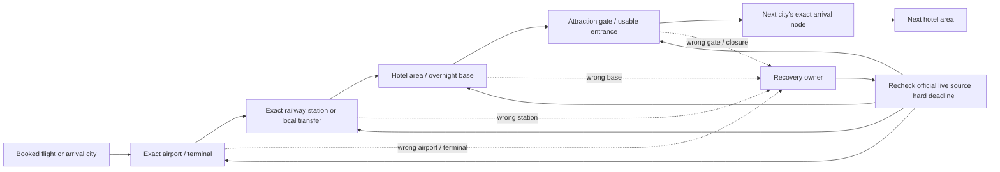

# China ten-city transport decision network

- Status: `TRANSPORT NETWORK LIVE SYNC READY — CENTRAL REVIEW REQUIRED`
- Live-sync and repository review date: `2026-08-21` (Asia/Shanghai)
- Research baseline: `origin/main@ef1898745a3c7a6e7cd308aa341c352f24fe9d01`
- Artifact type: internal, docs-only content architecture; not a public selector, timetable, price feed, or publication authorization

## Decision

Homeground should build the ten-city transport layer as a set of small, explicit decision owners joined by city Hubs. It should **not** build one generic transport guide per city, one page per station, or a database that pretends to know the traveller's live train, flight, terminal, port, weather, or fare.

The useful unit is a recoverable travel decision:

`confirmed flight or rail ticket → exact arrival node → suitable hotel/base → correct attraction gate → next confirmed departure node`

Each owner must answer one mistake-prone question, show what evidence changes the answer, and give a recovery path when the traveller is already at the wrong node. The ticket, airline, 12306 result, attraction operator, border authority, and current local transport notice always outrank a static article.

## Baseline and PR #74 publication state

This live sync starts from `origin/main@ef1898745a3c7a6e7cd308aa341c352f24fe9d01`, the merge commit for [PR #74](https://github.com/yangchunxuan/travel-china-with-xuan/pull/74). The PR head was `b66fc6cbca6f040a65db0d7e3727e3b2dac24580`.

Live GET readback on `2026-08-21` returned HTTP `200` for EN, ZH and KO and found every locale URL in `https://homegroundchina.com/sitemap.xml` for all five PR #74 identities. Four belong to this transport network:

- `destination-zhangjiajie`
- `zhangjiajie-national-forest-park-tickets-and-entrances`
- `chongqing-railway-station-selector`
- `destination-hangzhou`

The fifth identity, `china-online-arrival-card`, was also live in all three locales. These five identities are therefore **`PUBLISHED`**. The merged Search Map still carries an older `inProduction` / `not-published` record; that is a governance-backfill task, not evidence against the deployed pages and not permission to create replacement owners.

## The network

The city Hub owns the broad orientation and sends the reader to the relevant execution owner. The execution owner links back to the Hub and onward to the next decision. A Hub may summarize that a city has two airports or several major stations, but it must not reproduce the comparison, live access, or recovery logic.

## Status vocabulary

| Status | Meaning | What central may do next |
|---|---|---|
| `PUBLISHED` | Owner is in main and its EN/ZH/KO URLs returned HTTP 200 and appeared in the live sitemap on 2026-08-21 | Maintain the same owner; backfill stale governance records; do not create a synonym |
| `LIVE-MAIN` | Published owner already supported by the pre-existing production inventory | Maintain the same owner; do not create a synonym |
| `REMOTE-INVENTORY / NOT-PUBLISHED` | A remote branch contains a draft or Hub package only | Review as inventory, not as a live internal-link target |
| `UPDATE-OWNER` | A current owner needs a dated source refresh or stronger recovery | Edit the same canonical owner |
| `PROPOSED / DEFER` | A distinct decision survived the audit, but has no writing or publication authorization | Preserve the specification only; do not start an article |
| `MERGE-INTO-OWNER` | The query adds useful detail but no independent decision | Add the detail to the named current owner |
| `HOLD-RESEARCH / DEFER` | Potential value exists, but intent, official evidence, image rights, or overlap is unresolved | Research only; no page or indexable artifact |
| `DO-NOT-CREATE` | A known duplicate, mirror, thin split, or unsafe live-data product | Reject the page |

## What the audit found

- The audit covered the current main tree, the Search Map, `do-not-repeat.md`, the Topic Universe branch, 38 `origin/article/*` branches, and 53 `origin/codex/*` branches. GitHub searches for the proposed canonical slugs and topic IDs returned no matching open PR or open Issue. No second unmerged canonical owner was found for the ten-city network after PR #74 merged.
- The Topic Universe is a discovery snapshot, not production truth. It still labels several already published owners as candidates and assigns six station/airport ideas to a tools employee. Those identities may be useful, but the user has explicitly ruled out public selectors and data pages. Any surviving item must be centrally reassigned as a trilingual editorial guide.
- The strongest immediate work is maintenance, not net-new volume: release-day source refresh for the Beijing–Zhangjiajie–Shanghai owner, publication-day dynamic recheck for Guangzhou Baiyun, and Search Map backfill for the now-published PR #74 identities. Registry and Search Map use the same Beijing–Zhangjiajie–Shanghai title at this review; no title contradiction is recorded.
- Five distinct editorial gaps remain specifications only: Xi'an railway-station selection, Chengdu CTU/TFU airport selection, Guangzhou railway-hub selection, Shanghai railway-station selection, and Zhangjiajie airport/rail-hub orientation. All five are `PROPOSED / DEFER`; none has writing authorization.
- Guilin and Shenzhen need their city Hubs resolved before broad expansion. Their remote Hub drafts are inventory, not live destinations.
- Property-level Search Console data in the current Search Map covers `2026-07-09` through `2026-08-18` and reports 17 clicks from 1,060 impressions. Privacy filtering prevents page-level attribution. It supports a site-wide improve-and-measure strategy, but it does **not** prove that a particular corridor page has low CTR.

## Recommended order

### Wave 0 — repair ownership and freshness

1. Keep the four PR #74 transport-network identities marked `PUBLISHED`; backfill stale Search Map status without changing canonical ownership.
2. Refresh `beijing-zhangjiajie-shanghai-transport` against current 12306/airport evidence, retain one corridor owner, and establish page-level measurement before judging CTR. Registry and Search Map titles already match.
3. Recheck `guangzhou-baiyun-airport-t2-t3` on its next publication date. The current owner already covers the cessation of T1 passenger operations on 7 May 2026, T2/T3 choice, both Airport South stations not stopping, and wrong-terminal recovery; do not create terminal spin-offs.
4. Backfill Topic Universe/Search Map records that still describe already published transport pages as unmapped candidates.

### Wave 1 — proposed/deferred specifications; no writing authorization

1. `hg-topic-0881` — Xi'an railway-station selector, with the stale “Xi'an West” seed corrected only after a live 12306 roster check; Xi'an East opened on 30 June 2026.
2. `hg-topic-0858` — Chengdu CTU or TFU, based on the actual flight, hotel/base, railway connection, and first/last-night risk.
3. `hg-topic-0864` — Guangzhou railway-hub selector, reflecting the 2026 Guangzhou/Guangzhou Baiyun role change.
4. `hg-topic-0875` — Shanghai railway-station selector, distinct from the PVG/SHA airport owner and Shanghai–Hangzhou route owner.
5. `hg-topic-0265` — Zhangjiajie airport and rail hubs, distinct from the city-versus-Wulingyuan hotel decision and park entrance workflow.

These five currently exist only as Topic Universe seeds and this design package. Their status is `PROPOSED / DEFER`: no article body, branch, Registry entry, internal link, or publication work is authorized here.

### Wave 2 — existing hold/defer inventory; no writing authorization

- `hg-topic-0305` Chengdu–Chongqing — `HOLD / DEFER`; the selector is published, but Chongqing Hub routing remains unresolved.
- `hg-topic-0856` Beijing PEK or PKX — `HOLD / DEFER`.
- `hg-topic-0859` Chengdu railway-station selector — `HOLD / DEFER`.
- `hg-topic-0360` Hangzhou East Station to a confirmed West Lake gate/hotel — `HOLD / DEFER`.
- `hg-topic-0347` Guilin to a confirmed Longji village/entrance — `HOLD / DEFER`.
- `hg-topic-0342` Zhangjiajie West Station to Wulingyuan — `HOLD / DEFER`.
- `hg-topic-0876` Shenzhen railway-hub selector — `HOLD / DEFER`; its recorded boundary excludes port choice and Hong Kong border execution.

### Hold or merge

- Hold `hg-topic-0865` Guilin railway selector until a separate city-base decision is proven beyond the existing Guilin–Yangshuo owner.
- Hold `hg-topic-0867` Hangzhou railway selector until the new Hub and Shanghai–Hangzhou owner overlap is measured.
- Hold Guangzhou–Shenzhen, Beijing–Xi'an, Xi'an–Chengdu, and other mirror-like city pairs until they demonstrate a door-to-door decision that current route-order owners do not answer.
- Merge the old Zhangjiajie park-gates seed into `zhangjiajie-national-forest-park-tickets-and-entrances`.

## Non-negotiable implementation contract

Every future authorized owner must:

1. use one canonical page for both travel directions unless the reverse trip genuinely changes the decision;
2. begin with the exact ticket/flight/gate evidence that controls the answer;
3. use current official primary sources and state `checked_at`, scope, exception, and recheck trigger for every dynamic fact;
4. avoid fixed fares, frequencies, timetables, terminal assignments, or “always” statements;
5. include wrong-node recovery and a hard-deadline decision;
6. keep EN/ZH/KO block IDs, types, order, numbers, proper nouns, negatives, recovery, Sources, and links aligned while rewriting naturally in each language;
7. link both ways with the current city Hub and 2–4 live execution owners; never link to a remote or unpublished candidate as though it were live;
8. use only real, place-accurate, rights-clear images, with source, author, licence, location, date, crop, original SHA-256, and derivative SHA-256; AI-generated and AI-assisted documentary images are zero;
9. keep the CTA light: ask for travel date, party size, exact ticket/flight, hotel/base, luggage or mobility constraints, and hard deadline;
10. pass the content, locale-parity, TypeScript, inquiry, production-build, SEO/export, image, browser, accessibility, and diff gates listed in [qa.md](./qa.md).

## Package index

- [coverage-audit.md](./coverage-audit.md) — the ten-city keep/update/merge/gap/do-not-repeat audit.
- [canonical-matrix.md](./canonical-matrix.md) — canonical owners, boundaries, dependencies, recovery ownership, and priority.
- [implementation-packages.md](./implementation-packages.md) — deferred design briefs and explicit hold conditions; not writing authorization.
- [source-ledger.md](./source-ledger.md) — official source packs, checked scope, limitations, and image leads.
- [qa.md](./qa.md) — present docs-only checks and mandatory future article/release gates.

No article, Hub, Registry entry, route, tool, public data page, dependency, deployment, or PR is created by this package.
