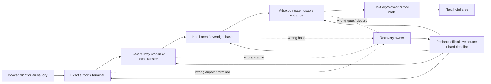

# China ten-city transport decision network

- Status: `CENTRAL REVIEW REQUIRED`
- Research and repository review date: `2026-08-20`
- Research baseline: `origin/main@ef1898745a3c7a6e7cd308aa341c352f24fe9d01`
- Artifact type: internal, docs-only content architecture; not a public selector, timetable, price feed, or publication authorization

## Decision

Homeground should build the ten-city transport layer as a set of small, explicit decision owners joined by city Hubs. It should **not** build one generic transport guide per city, one page per station, or a database that pretends to know the traveller's live train, flight, terminal, port, weather, or fare.

The useful unit is a recoverable travel decision:

`confirmed flight or rail ticket → exact arrival node → suitable hotel/base → correct attraction gate → next confirmed departure node`

Each owner must answer one mistake-prone question, show what evidence changes the answer, and give a recovery path when the traveller is already at the wrong node. The ticket, airline, 12306 result, attraction operator, border authority, and current local transport notice always outrank a static article.

## Baseline and PR #74 race condition

The audit began from `origin/main@cbbfddabe2513874cc4e55981e08244db7338ff9`. During the read-only review, [PR #74](https://github.com/yangchunxuan/travel-china-with-xuan/pull/74) was merged. This worktree was fast-forwarded to its merge commit, `ef1898745a3c7a6e7cd308aa341c352f24fe9d01`; the PR head was `b66fc6cbca6f040a65db0d7e3727e3b2dac24580`.

That changes repository ownership, but not yet the publication claim. The merged Search Map still marks these transport-network identities as `inProduction` and `not-published`:

- `destination-zhangjiajie`
- `zhangjiajie-national-forest-park-tickets-and-entrances`
- `chongqing-railway-station-selector`
- `destination-hangzhou`

They are therefore recorded here as **`MAIN-INTEGRATED / PUBLICATION-UNVERIFIED`**. They reserve their canonical scopes and must not be recreated. Central should confirm the deployed URL, indexability, locale alternates, images, and Search Map backfill before calling them live.

## The network

The city Hub owns the broad orientation and sends the reader to the relevant execution owner. The execution owner links back to the Hub and onward to the next decision. A Hub may summarize that a city has two airports or several major stations, but it must not reproduce the comparison, live access, or recovery logic.

## Status vocabulary

| Status | Meaning | What central may do next |
|---|---|---|
| `LIVE-MAIN` | Repository and Search Map support a published owner | Maintain the same owner; do not create a synonym |
| `MAIN-INTEGRATED / PUBLICATION-UNVERIFIED` | Code/content is in main, but this audit has no deployed readback and the Search Map still says not published | Verify deployment and backfill governance; do not recreate |
| `REMOTE-INVENTORY / NOT-PUBLISHED` | A remote branch contains a draft or Hub package only | Review as inventory, not as a live internal-link target |
| `UPDATE-OWNER` | A current owner needs new official facts, title alignment, or stronger recovery | Edit the same canonical owner |
| `NEW-EDITORIAL-CANDIDATE` | A distinct decision survives the canonical audit | Central must approve/reassign it before article implementation |
| `MERGE-INTO-OWNER` | The query adds useful detail but no independent decision | Add the detail to the named current owner |
| `HOLD-RESEARCH` | Potential value exists, but intent, official evidence, image rights, or overlap is unresolved | Research only; no page or indexable artifact |
| `DO-NOT-CREATE` | A known duplicate, mirror, thin split, or unsafe live-data product | Reject the page |

## What the audit found

- The audit covered the current main tree, the Search Map, `do-not-repeat.md`, the Topic Universe branch, 38 `origin/article/*` branches, and 53 `origin/codex/*` branches. GitHub searches for the proposed canonical slugs and topic IDs returned no matching open PR or open Issue. No second unmerged canonical owner was found for the ten-city network after PR #74 merged.
- The Topic Universe is a discovery snapshot, not production truth. It still labels several already published owners as candidates and assigns six station/airport ideas to a tools employee. Those identities may be useful, but the user has explicitly ruled out public selectors and data pages. Any surviving item must be centrally reassigned as a trilingual editorial guide.
- The strongest immediate work is maintenance, not net-new volume: refresh the Beijing–Zhangjiajie–Shanghai owner, correct Guangzhou Baiyun's 2026 terminal facts, verify PR #74 deployment, and reconcile the Search Map/Registry/title surfaces.
- The clearest independent editorial gaps are: Xi'an railway-station selection, Chengdu CTU/TFU airport selection, Guangzhou railway-hub selection, Shanghai railway-station selection, and Zhangjiajie airport/rail-hub orientation. Each still requires central authorization before implementation.
- Guilin and Shenzhen need their city Hubs resolved before broad expansion. Their remote Hub drafts are inventory, not live destinations.
- Property-level Search Console data in the current Search Map covers `2026-07-09` through `2026-08-18` and reports 17 clicks from 1,060 impressions. Privacy filtering prevents page-level attribution. It supports a site-wide improve-and-measure strategy, but it does **not** prove that a particular corridor page has low CTR.

## Recommended order

### Wave 0 — repair ownership and freshness

1. Verify the four PR #74 transport-network identities on the deployed site, then update their publication status without changing canonical ownership.
2. Refresh `beijing-zhangjiajie-shanghai-transport` against current 12306/airport evidence, align all title surfaces, retain one corridor owner, and establish page-level measurement before judging CTR.
3. Update `guangzhou-baiyun-airport-t2-t3` for the current T2/T3 operation and wrong-terminal recovery. Do not produce terminal spin-offs.
4. Backfill Topic Universe/Search Map records that still describe already published transport pages as unmapped candidates.

### Wave 1 — highest-value independent candidates

1. `hg-topic-0881` — Xi'an railway-station selector, with the stale “Xi'an West” seed corrected only after a live 12306 roster check; Xi'an East opened on 30 June 2026.
2. `hg-topic-0858` — Chengdu CTU or TFU, based on the actual flight, hotel/base, railway connection, and first/last-night risk.
3. `hg-topic-0864` — Guangzhou railway-hub selector, reflecting the 2026 Guangzhou/Guangzhou Baiyun role change.
4. `hg-topic-0875` — Shanghai railway-station selector, distinct from the PVG/SHA airport owner and Shanghai–Hangzhou route owner.
5. `hg-topic-0265` — Zhangjiajie airport and rail hubs, distinct from the city-versus-Wulingyuan hotel decision and park entrance workflow.

These five currently exist only as Topic Universe seeds. Central must first change their artifact type/assignee from tool to editorial where applicable and issue implementation authorization.

### Wave 2 — conditional execution owners

- `hg-topic-0305` Chengdu–Chongqing: proceed only after Chongqing selector deployment and Hub routing are resolved.
- `hg-topic-0856` Beijing PEK or PKX: proceed as a pre-booking whole-trip decision, never as “which is closer to downtown?”
- `hg-topic-0859` Chengdu railway-station selector.
- `hg-topic-0360` Hangzhou East Station to a confirmed West Lake gate/hotel.
- `hg-topic-0347` Guilin to a confirmed Longji village/entrance.
- `hg-topic-0342` Zhangjiajie West Station to Wulingyuan.
- `hg-topic-0876` Shenzhen railway-hub selector only if rewritten to exclude port choice and Hong Kong border execution.

### Hold or merge

- Hold `hg-topic-0865` Guilin railway selector until a separate city-base decision is proven beyond the existing Guilin–Yangshuo owner.
- Hold `hg-topic-0867` Hangzhou railway selector until the new Hub and Shanghai–Hangzhou owner overlap is measured.
- Hold Guangzhou–Shenzhen, Beijing–Xi'an, Xi'an–Chengdu, and other mirror-like city pairs until they demonstrate a door-to-door decision that current route-order owners do not answer.
- Merge the old Zhangjiajie park-gates seed into `zhangjiajie-national-forest-park-tickets-and-entrances`.

## Non-negotiable implementation contract

Every approved owner must:

1. use one canonical page for both travel directions unless the reverse trip genuinely changes the decision;
2. begin with the exact ticket/flight/gate evidence that controls the answer;
3. use current official primary sources and state `checked_at`, scope, exception, and recheck trigger for every dynamic fact;
4. avoid fixed fares, frequencies, timetables, terminal assignments, or “always” statements;
5. include wrong-node recovery and a hard-deadline decision;
6. keep EN/ZH/KO block IDs, types, order, numbers, proper nouns, negatives, recovery, Sources, and links aligned while rewriting naturally in each language;
7. link both ways with the current city Hub and 2–4 live execution owners; never link to a remote or unpublished candidate as though it were live;
8. use only real, place-accurate, rights-clear images, with source, author, licence, location, date, crop, original SHA-256, and derivative SHA-256; AI-generated and AI-assisted documentary images are zero;
9. keep the CTA light: ask for travel date, party size, exact ticket/flight, hotel/base, luggage or mobility constraints, and hard deadline;
10. pass the content, locale-parity, TypeScript, inquiry, production-build, SEO/export, image, browser, accessibility, and diff gates listed in [qa.md](./qa.md).

## Package index

- [coverage-audit.md](./coverage-audit.md) — the ten-city keep/update/merge/gap/do-not-repeat audit.
- [canonical-matrix.md](./canonical-matrix.md) — canonical owners, boundaries, dependencies, recovery ownership, and priority.
- [implementation-packages.md](./implementation-packages.md) — implementation-ready briefs for approved future work and explicit hold conditions.
- [source-ledger.md](./source-ledger.md) — official source packs, checked scope, limitations, and image leads.
- [qa.md](./qa.md) — present docs-only checks and mandatory future article/release gates.

No article, Hub, Registry entry, route, tool, public data page, dependency, deployment, or PR is created by this package.
